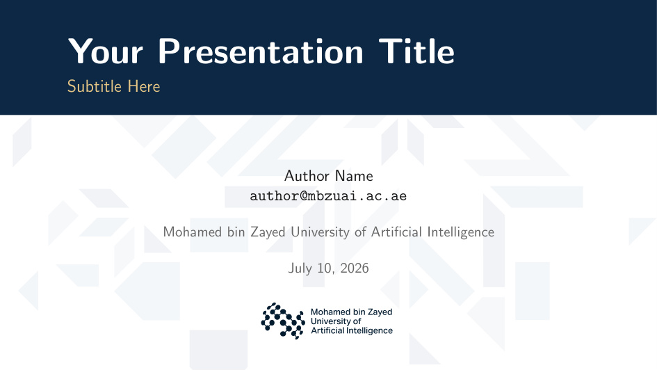
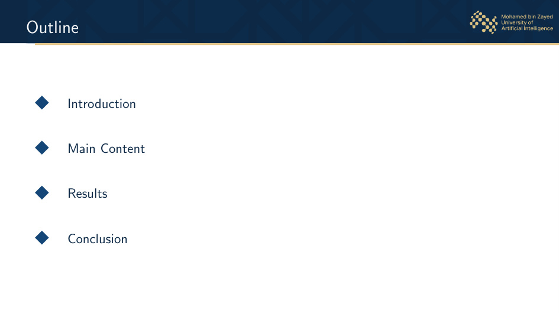
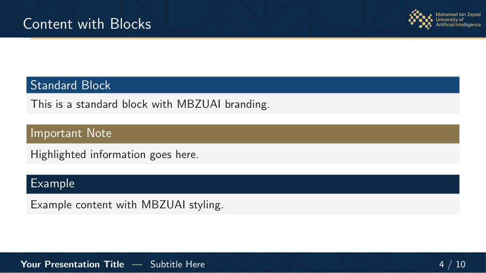
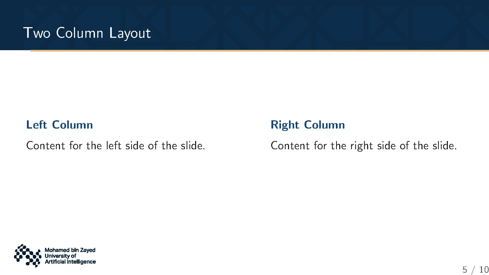
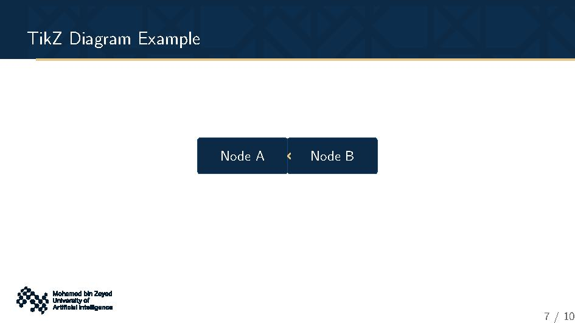
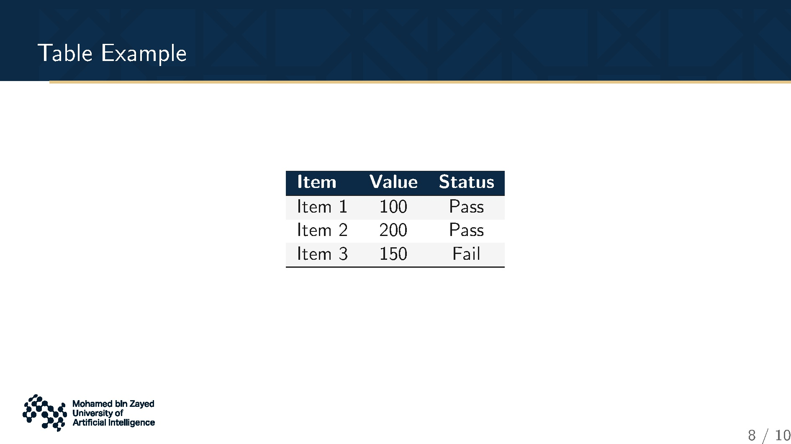
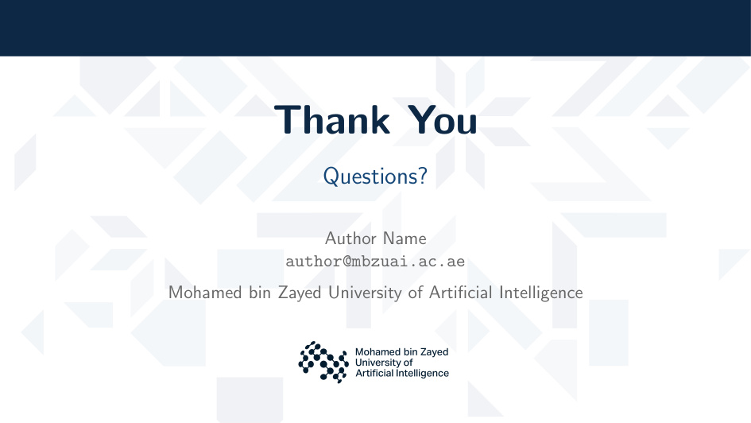

# MBZUAI Beamer Theme

A LaTeX Beamer presentation theme based on the **Mohamed bin Zayed University of Artificial Intelligence (MBZUAI)** brand guidelines (March 2026, V1).

## Features

- 🎨 Official MBZUAI brand colors
- 📐 16:9 widescreen layout
- 🖼️ Frametitle banner with subtle pattern background
- 📄 Custom title page and "Thank You" slide
- 🧱 Styled blocks (standard, alert, example)
- 📊 Brand-colored tables
- 🔷 Diamond bullet markers in table of contents

## Preview

<p align="center">
  <br>
  <em>Title Slide</em>
</p>

<p align="center">
  <br>
  <em>Outline</em>
</p>

<p align="center">
  <br>
  <em>Content with Blocks</em>
</p>

<p align="center">
  <br>
  <em>Two Column Layout</em>
</p>

<p align="center">
  <br>
  <em>TikZ Diagram</em>
</p>

<p align="center">
  <br>
  <em>Table Example</em>
</p>

<p align="center">
  <br>
  <em>Thank You Slide</em>
</p>

## Installation

### Option 1: Local (recommended)

Copy the `beamerthemeMBZUAI/` directory to your project:

```bash
cp -r beamerthemeMBZUAI/ /path/to/your/project/
```

### Option 2: TeXMF (system-wide)

```bash
cp -r beamerthemeMBZUAI/ ~/Library/texmf/tex/latex/beamer/
```

## Usage

```latex
\documentclass[aspectratio=169, 11pt]{beamer}

\usetheme{MBZUAI}

\title[Short Title]{Your Presentation Title}
\subtitle{Subtitle Here}
\author[Author Name]{Author Name \\ \texttt{author@mbzuai.ac.ae}}
\institute[MBZUAI]{Mohamed bin Zayed University of Artificial Intelligence}
\date{\today}

\begin{document}

% Title slide (automatic)
\begin{frame}[t]
\titlepage
\end{frame}

% Content slides
\section{Introduction}
\begin{frame}{Introduction}
    \begin{itemize}
        \item Your content here
    \end{itemize}
\end{frame}

% Thank You slide
{
\setbeamertemplate{footline}{}
\setbeamertemplate{frametitle}{}
\begin{frame}[t]
    \mbzuaiThankYou
\end{frame}
}

\end{document}
```

## Available Colors

| Color | Hex | Usage |
|-------|-----|-------|
| `mbzuai-dark-navy` | `#0C2945` | Primary backgrounds, headers |
| `mbzuai-navy` | `#154677` | Secondary backgrounds |
| `mbzuai-sand` | `#E5C687` | Accent elements, highlights |
| `mbzuai-dark-sand` | `#8A764D` | Secondary accents |
| `mbzuai-light-gray` | `#F5F5F5` | Block backgrounds |
| `mbzuai-text` | `#1A1A1A` | Body text |
| `mbzuai-subtle` | `#666666` | Secondary text |

Use these colors in your presentation:

```latex
\textcolor{mbzuai-navy}{\textbf{Important text}}
\color{mbzuai-sand} highlighted text
```

## Customization

### Thank You Slide

The `\mbzuaiThankYou` macro creates a "Thank You" slide with:
- Subtle pattern background
- Navy header bar
- "Thank You" title
- "Questions?" subtitle
- Email and institute from `\insertemail` and `\insertinstitute`

### Title Page

The title page is automatically generated from `\title`, `\subtitle`, `\author`, `\institute`, and `\date`.

## Regenerating the Banner

The frametitle banner (`assets/banner-bg.pdf`) is pre-built. To regenerate it:

```bash
cd assets/
pdflatex make-banner-bg.tex
cp make-banner-bg.pdf banner-bg.pdf
```

**Note:** Regenerating requires the MBZUAI pattern asset:
`MBZUAI-Patterns/CROPS/CMYK/PDF/MBZUAI_PATTERN_CROP 01_NAVY_CMYK.pdf`

## Building the Demo

**推荐使用 `latexmk`（自动处理多次编译）：**

```bash
cd beamerthemeMBZUAI/
latexmk -pdf demo.tex
```

**或手动编译（至少两次）：**

```bash
pdflatex demo.tex
pdflatex demo.tex
pdflatex demo.tex  # 确保所有 overlay 渲染正确
```

> **⚠️ 为什么需要多次编译？**
>
> 首页和尾页的背景（pattern、navy bar）使用了 TikZ 的 `remember picture, overlay` 机制，需要将节点绝对位置写入 `.aux` 文件后再次读取才能正确定位。第一次编译记录位置，第二次编译才能正确渲染背景。这是 LaTeX 的固有行为。

## File Structure

```
beamerthemeMBZUAI/
├── beamerthemeMBZUAI.sty          # Main theme loader
├── beamercolorthemeMBZUAI.sty     # Brand color definitions
├── beamerinnerthemeMBZUAI.sty     # Title page, Thank You, blocks
├── beamerouterthemeMBZUAI.sty     # Frametitle, footline
├── beamerfontthemeMBZUAI.sty      # Font settings
├── assets/
│   ├── banner-bg.pdf              # Frametitle banner background
│   ├── pattern-bg.pdf             # Title/Thank You pattern
│   └── make-banner-bg.tex         # Banner source
├── demo.tex                       # Example presentation
├── README.md                      # This file
└── LICENSE                        # MIT License
```

## License

MIT License — see [LICENSE](LICENSE) for details.

## Brand Guidelines

This theme is based on the official MBZUAI Brand Guidelines (March 2026, V1). For the authoritative brand rules, refer to the official document.

**Pattern assets** are © Mohamed bin Zayed University of Artificial Intelligence and are included with permission for use in presentations.
